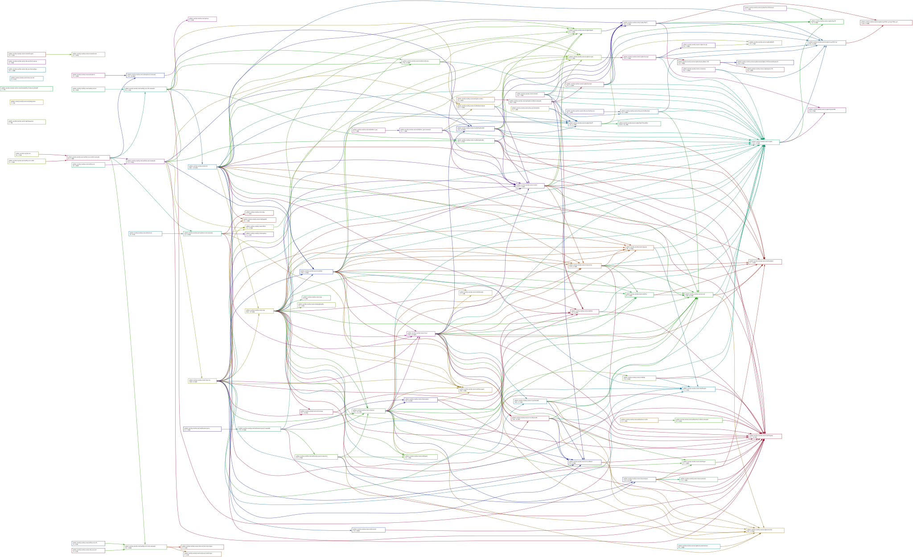

# Skycoin

[](https://github.com/skycoin/skycoin/actions)
[](https://godoc.org/github.com/skycoin/skycoin)
[](https://goreportcard.com/report/github.com/skycoin/skycoin)

Skycoin is a next-generation cryptocurrency.

Skycoin was written from scratch and designed over four years to realize the
ideal of Bitcoin and represents the apex of cryptocurrency design.
Skycoin is not designed to add features to Bitcoin,
but rather improves Bitcoin by increasing simplicity,
security and stripping out everything non-essential.

Some people have hyped the Skycoin Project as leading into "Bitcoin 3.0".
The coin itself is not "Bitcoin 3.0",
but is rather "Bitcoin 1.0". Bitcoin is a prototype crypto-coin.
Skycoin was designed to be what Bitcoin would look like if it were built from
scratch, to remedy the rough edges in the Bitcoin design.

- no duplicate coin-base outputs
- enforced checks for hash collisions
- simple deterministic wallets
- no transaction malleability
- no signature malleability
- removal of the scripting language
- CoinJoin and normal transactions are indistinguishable
- elimination of edge-cases that prevent independent node implementations
- <=10 second transaction times
- elimination of the need for mining to achieve blockchain consensus

## Skycoin Distribution

Skycoin is not mined. The maximum supply is 100,000,000 SKY.

Distribution occurs through the [Skywire Network](https://github.com/skycoin/skywire) reward system. Approximately 816,000 Skycoin are distributed annually to eligible Skywire visors that meet uptime and network participation requirements.

For detailed reward eligibility requirements and current distribution rules, see:
* [Skywire Mainnet Reward Rules](https://github.com/skycoin/skywire/blob/develop/rewards/mainnet_rules.md)
* [Skywire Reward Dashboard](https://fiber.skywire.dev)

Skywire visors do not process Skycoin transactions or sync the Skycoin blockchain. The reward system serves solely as the distribution mechanism for Skycoin.

## Decentralization Through Fibercoins

Skycoin's approach to decentralization differs from proof-of-work or proof-of-stake consensus models. Rather than forcing all activity onto a single blockchain, Skycoin enables users to create custom fiber coins — independent blockchains with their own parameters, distribution models, and governance. The [newcoin tool](./cmd/newcoin/README.md) makes this process straightforward.

This multi-chain architecture allows:
* Independent blockchains without competition for resources
* Custom tokenomics and distribution models per fibercoin
* Simpler, more predictable system requirements compared to shared-chain token models

## Links

* [skycoin.com](https://www.skycoin.com)
* [Skycoin Blog](https://www.skycoin.com/blog)
* [Skycoin Docs](https://www.skycoin.com/docs)
* [Skycoin Blockchain Explorer](https://explorer.skycoin.com)
* [Skycoin Telegram Chat](https://t.me/skycoin)
* [Skycoin Telegram Support](https://t.me/skywire)
* [Skycoin Github Wiki](https://github.com/skycoin/skycoin/wiki)

## Table of Contents

<!-- MarkdownTOC levels="1,2,3,4,5" autolink="true" bracket="round" -->

- [Changelog](#changelog)
- [Skycoin Distribution](#skycoin-distribution)
- [Decentralization Through Fibercoins](#decentralization-through-fibercoins)
- [Links](#links)
- [Installation](#installation)
	- [Go 1.23+ Installation and Setup](#go-123-installation-and-setup)
	- [Go get skycoin](#go-get-skycoin)
	- [Run Skycoin from the command line](#run-skycoin-from-the-command-line)
	- [Show Skycoin node options](#show-skycoin-node-options)
	- [Run Skycoin with options](#run-skycoin-with-options)
	- [Docker image](#docker-image)
	- [Building your own images](#building-your-own-images)
	- [Development image](#development-image)
- [API Documentation](#api-documentation)
	- [REST API](#rest-api)
	- [Skycoin command line interface](#skycoin-command-line-interface)
- [Integrating Skycoin with your application](#integrating-skycoin-with-your-application)
- [Contributing a node to the network](#contributing-a-node-to-the-network)
- [Creating a new coin](#creating-a-new-coin)
- [Daemon CLI Options](#daemon-cli-options)
- [URI Specification](#uri-specification)
- [Wire protocol user agent](#wire-protocol-user-agent)
- [Offline transaction signing](#offline-transaction-signing)
- [Deploy a public Skycoin API node with HTTPS](#deploy-a-public-skycoin-api-node-with-https)
- [Development](#development)
	- [Modules](#modules)
	- [Client libraries](#client-libraries)
	- [Running Tests](#running-tests)
	- [Running Integration Tests](#running-integration-tests)
		- [Stable Integration Tests](#stable-integration-tests)
		- [Live Integration Tests](#live-integration-tests)
		- [Debugging Integration Tests](#debugging-integration-tests)
		- [Update golden files in integration testdata](#update-golden-files-in-integration-testdata)
	- [Test coverage](#test-coverage)
		- [Test coverage for the live node](#test-coverage-for-the-live-node)
	- [Formatting](#formatting)
	- [Code Linting](#code-linting)
	- [Profiling](#profiling)
	- [Fuzzing](#fuzzing)
		- [base58](#base58)
		- [encoder](#encoder)
	- [Dependencies](#dependencies)
		- [Rules](#rules)
		- [Management](#management)
	- [Configuration Modes](#configuration-modes)
		- [Development Desktop Client Mode](#development-desktop-client-mode)
		- [Server Daemon Mode](#server-daemon-mode)
		- [Electron Desktop Client Mode](#electron-desktop-client-mode)
		- [Standalone Desktop Client Mode](#standalone-desktop-client-mode)
	- [Wallet GUI Development](#wallet-gui-development)
		- [Translations](#translations)
	- [Releases](#releases)
		- [Update the version](#update-the-version)
		- [Check the translations](#check-the-translations)
		- [Pre-release testing](#pre-release-testing)
		- [Creating release builds](#creating-release-builds)
		- [Release signing](#release-signing)
- [Responsible Disclosure](#responsible-disclosure)

<!-- /MarkdownTOC -->

## Changelog

[CHANGELOG.md](CHANGELOG.md)

## Installation

Skycoin supports go1.23+.

The `skycoin` binary includes multiple utilities as subcommands:

* **cli** - Command line interface for wallet operations, blockchain queries, and transaction management
* **daemon** - Full node daemon with wallet functionality and web interface
* **explorer** - Blockchain explorer with web interface
* **newcoin** - Tool for creating custom fiber coins ([see documentation](./cmd/newcoin/README.md))
* **web** - Thin client web wallet

**Note on flag format:** Skycoin now uses GNU/POSIX standard flags (`-f` or `--flag`) instead of Go-style flags (`-flag`).

### Recommended Installation Methods

Choose one of the following methods (in order of recommendation):

#### 1. Run directly with Go (recommended for testing)

```sh
$ go run github.com/skycoin/skycoin@develop
```

Or with a specific command:

```sh
$ go run github.com/skycoin/skycoin@develop daemon --help
$ go run github.com/skycoin/skycoin@develop cli addressGen
```

#### 2. Install to GOPATH/bin

```sh
$ go install github.com/skycoin/skycoin@develop
$ skycoin --version
$ skycoin daemon --help
```

#### 3. Download release binaries

Download the latest release for your platform from:
https://github.com/skycoin/skycoin/releases

Extract and run:
```sh
$ ./skycoin --version
```

#### 4. Compile from source

```sh
$ git clone https://github.com/skycoin/skycoin
$ cd skycoin
$ go build -o skycoin .
$ ./skycoin --version
```


### Running Skycoin

Once installed, the `skycoin` binary provides access to all utilities:

```sh
# Run the daemon (default command)
$ skycoin daemon

# Show daemon options
$ skycoin daemon --help

# Run with custom options (note: GNU/POSIX flags)
$ skycoin daemon --launch-browser=false --data-dir=/custom/path

# Use CLI tools
$ skycoin cli addressGen
$ skycoin cli addressBalance <address>

# Start blockchain explorer
$ skycoin explorer

# Create a new fibercoin
$ skycoin newcoin config > mycoin.toml
```

### Command Usage Examples

```sh
    ┌─┐┬┌─┬ ┬┌─┐┌─┐┬┌┐┌
    └─┐├┴┐└┬┘│  │ │││││
    └─┘┴ ┴ ┴ └─┘└─┘┴┘└┘

 Available Commands:    
  cli       skycoin command line interface    
  daemon    skycoin wallet  
  explorer  skycoin blockchain explorer  
  newcoin   newcoin is a helper tool for creating new fiber coins  
  web       skycoin thin client web wallet

Flags:
  -b, --bv        print runtime/debug.BuildInfo.Main.Version
  -d, --info      print runtime/debug.BuildInfo
  -v, --version   version for skycoin
```

### Docker

[DOCKER.md](DOCKER.md).

## API Documentation

### REST API

[REST API](src/api/README.md).

### Skycoin command line interface

The CLI is accessed via `skycoin cli` subcommand. See [CLI command API](cmd/skycoin-cli/README.md) for detailed documentation.

Example:
```sh
$ skycoin cli addressGen
$ skycoin cli addressBalance <address>
$ skycoin cli walletCreate -l "My Wallet"
```

## Integrating Skycoin with your application

[Skycoin Integration Documentation](INTEGRATION.md)

## Contributing a node to the network

Add your node's `ip:port` to the [peers.txt](peers.txt) file.
This file will be periodically uploaded to https://downloads.skycoin.com/blockchain/peers.txt
and used to seed client with peers.

*Note*: Do not add Skywire nodes to `peers.txt`.
Only add Skycoin nodes with high uptime and a static IP address (such as a Skycoin node hosted on a VPS).

## Creating a new coin

See the [Fibercoin Creation Documentation](./cmd/newcoin/README.md)

## Daemon CLI Options

See the [Skycoin Daemon CLI options](./cmd/skycoin/README.md)

## URI Specification

Skycoin URIs obey the same rules as specified in Bitcoin's [BIP21](https://github.com/bitcoin/bips/blob/master/bip-0021.mediawiki).
They use the same fields, except with the addition of an optional `hours` parameter, specifying the coin hours.

Example Skycoin URIs:

* `skycoin:2hYbwYudg34AjkJJCRVRcMeqSWHUixjkfwY`
* `skycoin:2hYbwYudg34AjkJJCRVRcMeqSWHUixjkfwY?amount=123.456&hours=70`
* `skycoin:2hYbwYudg34AjkJJCRVRcMeqSWHUixjkfwY?amount=123.456&hours=70&label=friend&message=Birthday%20Gift`

Additonally, if no `skycoin:` prefix is present when parsing, the string may be treated as an address:

* `2hYbwYudg34AjkJJCRVRcMeqSWHUixjkfwY`

However, do not use this URI in QR codes displayed to the user, because the address can't be disambiguated from other Skyfiber coins.

## Wire protocol user agent

[Wire protocol user agent description](https://github.com/skycoin/skycoin/wiki/Wire-protocol-user-agent)

## Hardware Wallet

Hardware wallet commands are **not included** in the default `skycoin` binary. To use hardware wallets, compile separately:

```sh
$ cd cmd/hardware-wallet
$ go build -o skycoin-hw .
$ ./skycoin-hw --help
```

Hardware wallet functionality is provided by:
* [hardware-wallet-daemon](https://github.com/skycoin/hardware-wallet-daemon) - HTTP API daemon for hardware wallets  
* [hardware-wallet-go](https://github.com/skycoin/hardware-wallet-go) - CLI interface for hardware wallets

**Note:** Hardware wallet support is currently limited to linux/amd64 platforms.

## Offline transaction signing

Before doing the offline transaction signing, we need to have the unsigned transaction created. Using the `skycoin cli` command to create an unsigned transaction in hot wallet, and copy the hex encoded transaction to the computer where the cold wallet is installed. Then use the `skycoin cli` command to sign it offline.

### Create an unsigned transaction

The `skycoin cli` tool replys on the APIs of the node or `skycoin daemon`, hence we have to start the node before running the tool.

 Go to the project root and run:

```bash
$ skycoin daemon --launch-browser=false
```

Once the node is started, we could use the following command to create an unsigned transaction.

```bash
$ skycoin cli createRawTransactionV2 $WALLET_NAME $RECIPIENT_ADDRESS $AMOUNT --unsign
```

> Note: Don't forget the `--unsign` flag, otherwise it would try to sign the transaction.

<details>
 <summary>View Output</summary>

```
b700000000e6b869f570e2bfebff1b4d7e7c9e86885dbc34d6de988da6ff998e7acd7e6e14010000000000000000000000000000000000000000000000000000000000000000000000000000000000000000000000000000000000000000000000000000000000000000010000007531184ad0afeebbff2049b855e0921329cb1cb74d769ac57c057c9c8bd2b6810100000000ed5ea2ca4fe9b4560409b50c5bf7cb39b6c5ff6e50690f00000000000000000000000000
```

</details>

Copy and save the generated transaction string. We will sign it with a cold wallet offline in the next section.

### Sign the transaction

The `skycoin node` needs to have the most recently `DB` so that the user would not lose much coin hours when signing the transaction. We could copy the full synchronized `data.db` from the hot wallet to the computer where the cold wallet is installed. And place it in `$HOME/.skycoin/data.db`. Then start the node with the network disabled.

```bash
$ skycoin daemon --launch-browser=false --disable-networking
```

Run the following command to sign the transaction:

```bash
$ skycoin cli signTransaction $RAW_TRANSACTION
```

The `$RAW_TRANSACTION` is the transaction string that we generated in the hot wallet.

If the cold wallet is encrypted, you will be prompted to enter the password to sign the transaction.

<details>
 <summary>View Output</summary>

```
b700000000e6b869f570e2bfebff1b4d7e7c9e86885dbc34d6de988da6ff998e7acd7e6e14010000000000000000000000000000000000000000000000000000000000000000000000000000000000000000000000000000000000000000000000000000000000000000010000007531184ad0afeebbff2049b855e0921329cb1cb74d769ac57c057c9c8bd2b6810100000000ed5ea2ca4fe9b4560409b50c5bf7cb39b6c5ff6e50690f00000000000000000000000000
```

</details>

Once the transaction is signed, we could copy and save the signed transaction string and broadcast it in the hot wallet.

```bash
$ skycoin cli broadcastTransaction $SIGNED_RAW_TRANSACTION
```

A transaction id would be returned and you can check it in the [explorer](https://explorer.skycoin.com).

## Deploy a public Skycoin API node with HTTPS

We recommend using [caddy server](https://caddyserver.com/) to deploy a public Skycoin API node on a
Linux server. The public API node should have the `HTTPS` support, which could be handled automatically
by the `caddy server`. But we need to have a domain and create a DNS record to bind the server ip address
to it.

Suppose we're going to deploy a Skycoin API node on `apitest.skycoin.com`, and we have already bound
the server's IP to it. Follow the steps below to complete the deployment.

### Install and run a skycoin api node

```bash
# Create a skycoin folder
$ mkdir $HOME/skycoin && cd $HOME/skycoin

# Download the latest skycoin binary from https://github.com/skycoin/skycoin/releases
$ wget https://downloads.skycoin.com/wallet/skycoin-VERSION-gui-standalone-linux-x64.tar.gz
$ tar -zxvf skycoin-VERSION-gui-standalone-linux-x64.tar.gz
$ cd skycoin-VERSION-gui-standalone-linux-x64

# Run with API enabled
$ ./skycoin -web-interface-port=6420 -host-whitelist=$DOMAIN_NAME -enable-api-sets="READ,TXN"
```

> Note: The `-host-whitelist` flag is required, otherwise the node will return `403 Forbidden` errors.

### Install the caddy server

```bash
# Create a caddy folder
$ mkdir $HOME/caddy && cd $HOME/caddy

# Download the latest caddy from https://github.com/caddyserver/caddy/releases
$ wget https://github.com/caddyserver/caddy/releases/download/vVERSION/caddy_vVERSION_linux_amd64.tar.gz
$ tar -zxvf caddy_vVERSION_linux_amd64.tar.gz
```

The `caddy` tool would be exist in the folder, let's create a `Caddyfile` to define the reverse proxy
rules now.

```bash
cat <<EOF >Caddyfile
apitest.skycoin.com {
   proxy / localhost:6420 {
      transparent
   }
}
EOF
```

Then run the caddy server

```bash
$ ./caddy
```

You will be prompted to enter an email address to receive the notifications from let's Encrypt.
That's all about the deployment, check the https://apitest.skycoin.com/api/v1/version to see if
the Skycoin API node is working correctly.

## Responsible Disclosure

Security flaws in skycoin source or infrastructure can be sent to security@skycoin.com.
Bounties are available for accepted critical bug reports.

PGP Key for signing:

```
-----BEGIN PGP PUBLIC KEY BLOCK-----

mDMEXYCYPxYJKwYBBAHaRw8BAQdAeDPi3n9xLv5xGsxbcbwZjfV4h772W+GPZ3Mz
RS17STm0L2lrZXRoZWFkb3JlIHNreWNvaW4gPGx1eGFpcmxha2VAcHJvdG9ubWFp
bC5jb20+iJYEExYIAD4WIQSY+TTwT5M0uB36M5iRO71SBrGWIAUCXYCYPwIbAwUJ
B4TOAAULCQgHAgYVCgkICwIEFgIDAQIeAQIXgAAKCRCRO71SBrGWID0NAP0VRiNA
2Kq2uakPMqV29HY39DVhc9QgxJfMIwXWtFxKAwEAn0NqGRV/iKXNf+qxqAtMWa5X
F2S36hkEfDHO5W44DwC4OARdgJg/EgorBgEEAZdVAQUBAQdAeiEz/tUmCgOA67Rq
ANmHmX2vrdZp/SfJ9KOI2ANCCm8DAQgHiH4EGBYIACYWIQSY+TTwT5M0uB36M5iR
O71SBrGWIAUCXYCYPwIbDAUJB4TOAAAKCRCRO71SBrGWIJOJAQDTaqxpcLtAw5kH
Hp2jWvUnLudIONeqeUTCmkLJhcNv1wD+PFJZWMKD1btIG4pkXRW9YoA7M7t5by5O
x5I+LywZNww=
=p6Gq
-----END PGP PUBLIC KEY BLOCK-----
```


Key ID: [0x913BBD5206B19620](https://pgp.mit.edu/pks/lookup?search=0x913BBD5206B19620&op=index)

The fingerprint for this key is:

```
pub   ed25519 2019-09-17 [SC] [expires: 2023-09-16]
      98F934F04F9334B81DFA3398913BBD5206B19620
uid           [ultimate] iketheadore skycoin <luxairlake@protonmail.com>
sub   cv25519 2019-09-17 [E] [expires: 2023-09-16]
```

Keybase.io account: https://keybase.io/iketheadore


## Dependency Graph

made with [goda](https://github.com/loov/goda)

```
go run github.com/loov/goda@latest graph github.com/skycoin/skycoin/... | dot -Tsvg -o docs/skycoin-goda-graph.svg
```


