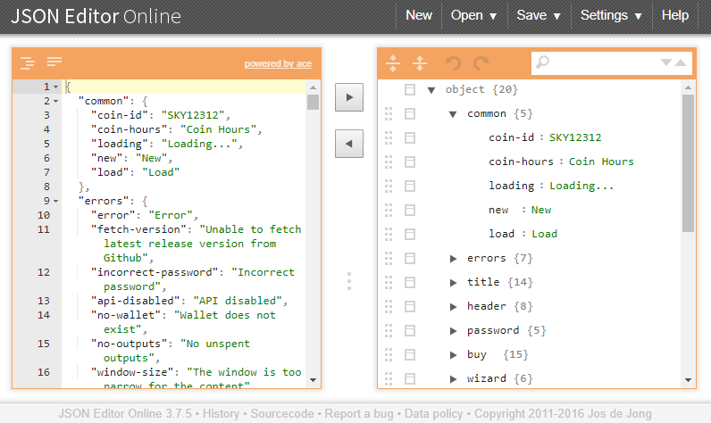
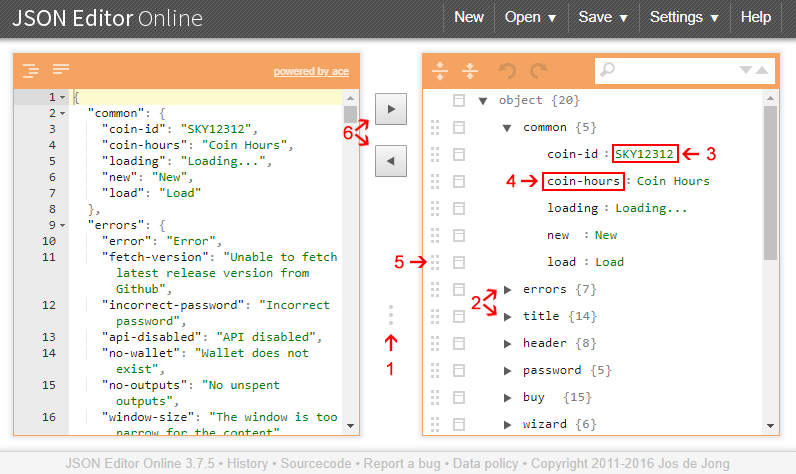

This folder contains the GUI translation files. To maintain order and be able
to easily make any necessary updates to the translation files after updating
the main text file, please follow its instructions if you are working with
its contents.

# Table of Contents

- [Contents of this folder](#contents-of-this-folder)
- [About the meaning of "xx" in this file](#about-the-meaning-of-"xx"-in-this-file)
- [Add a new translation](#add-a-new-translation)
- [Verify the translation files](#verify-the-translation-files)
  - [Checking for problems](#checking-for-problems)
  - [Checking if a language file needs to be updated](#checking-if-a-language-file-needs-to-be-updated)
- [Update a translation](#update-a-translation)
- [How to edit the translation files](#how-to-edit-the-translation-files)
  - [Which application should be used for editing the files](#which-application-should-be-used-for-editing-the-files)
  - [Special codes](#special-codes)
- [Writing style](#writing-style)
- [Make a translation available in the application](#make-a-translation-available-in-the-application)

# Contents of this folder

The contents of this folder are:

- `README.md`: this file.

- `check.js`: file with the script for detecting if a translation file has errors
or should be updated.

- `en.json`: main file with all the texts of the application, in English. It should
only be modified when changing the texts of the application (add, modify and
delete). This means that the file must not be modified while creating a new 
ranslation or modifying an existing one.

- Various `xx.json` files: files with the translated versions of the texts of
`en.json`.

- Various `xx_base.json` files: files with copies of `en.json` made the last time the
corresponding `xx.json` file was modified.

Normally there is no need to modify the first two files.

For more information about the `xx.json` and `xx_base.json`, please check the
[Add a new translation](#add-a-new-translation) and
[Update a translation](#update-a-translation) sections.

# About the meaning of "xx" in this file

Several parts of this file uses "xx" as part of file names or scripts, like
`xx.json` and `xx_base.json`. In fact, no file in this folder should be called
`xx.json` or `xx_base.json`, the "xx" part must be replaces with the two
characters code of the language. For example, if you are working with the Chinese
translation, the files will be `zh.json` and `zh_base.json`, instead of `xx.json`
and `xx_base.json`. The same if true for the scripts, if you are working with the
Chinese translation, instead of running `node check.js xx` you must run
`node check.js zh`.

# Add a new translation

First you must create in this folder two copies of the `en.json` file. The first
copy must be called `xx.json`, where the `xx` part must be the two characters code
of the new language. For example, for Chinese the name of the file should be
`zh.json`; for Spanish, `es.json`; for French, `fr.json`, etc.

The second copy of `en.json` must be renamed to `xx_base.json`, where the `xx` part
must be the two characters code of the new language. This means that if the first
copy is named `zh.json`, the second one should be named `zh_base.json`.

It is not necessary to follow a specific standard for the two characters code, but
it must be limited to two letters and be a recognizable code for the language.

After creating the two files, simply translate the texts in `xx.json`. Please make
sure you do not modify the structure of `xx.json`, just modify the texts.

The `xx_base.json` file must not be modified in any way, as it is used only as a way
to know what the state of `en.json` was the last time the `xx.json` file was
modified. This copy will be compared in the future with `en.json`, to verify if
there were modifications to `en.json` since the last time the translation file was
modified and if an update is needed.

If the `xx.json` and `xx_base.json` files do not have the same elements, the
automatic tests could fail when uploading the changes to the repository, preventing
the changes from being accepted, so, again, it is important not to modify the
structure of `xx.json`, but only its contents.

After doing all this, the translation will be ready, but will not be available in
the GUI until adding it to the code.

# Verify the translation files

This folder includes a script that is capable of automatically checking the
translation files, to detect problems and know what should be updated.

For using it, your computer must have `Node.js` installed.

## Checking for problems

For detecting basic problems on the translation files, open a command line window
in this folder and run `node check.js`. This will check the following:

- The `en.json` must exist, as it is the main language file for the app.

- For every `xx.json` file (except `en.json`) an `xx_base.json` file must exist
and viceversa.

- A `xx.json` file and its corresponding `xx_base.json` file must have the exact
same elements (only the content of that elements could be different), as the
`xx.json` is suposed to be the translation of the contents of `xx_base.json`.

As you can see, this only checks for errors that could be made while creating or
modifying the `xx.json` and `xx_base.json` files, and does not check if any
translation needs to be updated.

At the end of the script excecution, the console will display the list of all
errors found, if any. This check could be done automatically when making changes
to the repository, to reject updates with problems, so it is good idea to run it
manually before uploading changes.

Note: at this time the script does not check if the elements of the files are
in the same order, but this could be added in the future, so it is recomended
not to change the order of the elements.

## Checking if a language file needs to be updated

To detect if an specific language needs updating, run `node check.js xx`,
where xx is the two characters code of the language you want to check. If you
want to check all languages, run `node check.js all`.

By doing this, the script will perform all the checks described in the
[Checking for problems](#checking-for-problems) section, plus this:

- The `en.json` and `xx_base.json` should have the same elements. If `en.json`
has elements that `xx_base.json` does not contain, it means that, since the
last time the translation file was updated, new texts have been added to the
application. If `xx_base.json` has elements that `en.json` does not contain,
it means that, since the last time the translation file was updated, some texts
have been removed from the application. Both cases mean that the translation
file should be updated.

- The elements of `en.json` and `xx_base.json` should have the same content.
If any element have different content, it means that since the last time the
translation file was updated, some texts of the applications have been changed.
This means that the translation file should be updated.

At the end of the script excecution, the console will display the list of all
errors found, if any.

# Update a translation

Before updating a translation file, you should follow the steps of the
[Checking if a language file needs to be updated](#Checking-if-a-language-file-needs-to-be-updated)
section. By doing so you will quikly know exactly what texts must be added,
deleted or edited.

After doing that, make all the required modifications in the `xx.json` file,
this means adding, deleting and modifying all the elements indicated by the
script. Please be sure to modify only what is required and to add any new
element in the same position that it is in the `en.json` file. This process
is manual, so be sure check all the changes before finishing.

After doing the modifications in `xx.json`, delete the `xx_base.json` file,
create a copy of `en.json` and rename it `xx_base.json`. The objetive is to
simply update the `xx_base.json` file to the current state of `en.json`.
this will make possible to check in the future if more updates are nedded,
due to new changes in `en.json`.

Once all the changes are made, check again the language file as indicated
in the
[Checking if a language file needs to be updated](#Checking-if-a-language-file-needs-to-be-updated)
section. The script should not return errors. If the script returns errors,
please solve them before continuing.

# How to edit the translation files

The translation files are in json format (.json files). It is possible to
open these files in a text editor and edit them like normal text files.
However, the json files are used for coding and have a very strict format.
Because of this, **editing the files manually is not recommended** unless
you know exactly what you are doing.

If you do not know the json format, this section includes useful
information to be able to edit the files easily.

## Which application should be used for editing the files

There are several application that allow editing json files, including
some text editors. However, it is recommended to use the Json Editor app
for Google Chrome. Among the advantages of this application are that it
is multiplatform, it allows editing the contents without having to
directly modify the json code and has a relatively simple interface. You
can add it to your Chrome browser from here:
https://chrome.google.com/webstore/detail/json-editor/lhkmoheomjbkfloacpgllgjcamhihfaj

The app looks like this:



As you can see, you can load/save files on the upper-right corner of
the app. The left part shows the source code and the right part shows
a tree view of the elements of the file and its contents. You can
ignore the source code and work with the tree view only.



As you will not be editing the soutce code, you can hide it by presing
and draging the 3-dot button (1). While editing the file, you can use
the arrows (2) to expand/contract the different sections in which the
elements are organized. Once you find an item that you want to edit,
click on the content and modify the text (3). Please, do not make any
changes to the name of the element (4).

You can use the 6-dot buttons (5) to move the elements to a different
location, but please avoid doing it, as that could alter the order of
the file in a way that would make it stop working. Also, as you will
not be working with the source code, avoid using the arrow
buttons (6).

## Special codes

Some texts in the language files have special codes that are not
shown in the user interface of the wallet, but serve special purposes.
The codes are:

- **\\"**: due to how json files work, it is not possible to write
double quotes directly in the texts, the ccorrect way to add double
quotes to a json file is **\\"** (note that the 2 characters must not
be separated by a white space). If you use the Json Editor app for
Google Chrome, you can write double quotes normally and the app will
automatically add the **\\** character behind them, but that is just
a convenience for when you are writing, you could still find the
**\\"** code in files you are editing and have to work with it.

- **{{ }}**: any text block similar to **{{ something }}** is a
special identifier that the code will replace with a different value
when the app is running. For example, if you find a text like "Your
balance is {{ value }} coins", the application will show something
like "Your balance is 21 coins". In that example the "21" is a value
that the app has to calculate, so it is not possible to add it directly
into the language file. If you find a **{{ }}** text block, please do
not translate it, just move the whole **{{ }}** text block to where the
value should be displayed. If you want to leave a while space before the
value, simply add a white space before the **{{ }}** text block, and do
the same after it if you want a white space after the value.

- **\<br>**: this code means "new line". It is just a way to tell
the code that the text after it should be added in a new line.

# Writing style

The file contains many different types of texts: buttons, labels,
indications, titles and more. the name of each text can give important
information about what the text is used for and which writing format
should be used. Specifically, many texts have predefined prefixes or
suffixes that indicate what the text is used for and some special
characteristics that the text must follow. The prefixes and suffixes are:

- **title**: the text if the title of a page or a modal window. Those
text use title format, so each word must start with an uppercase letter
and don't end with period.

- **button**: the text is used in a small button (like the blue
confirmation buttons shown in most modal windows). Those text indicate
actions and should be kept as short as possible, as the button are small.
Those text use title format, so each word must start with an uppercase
letter and don't end with period.

- **title-and-button**: the text is a title, but it is also used inside
a button, so it must be treated as a title, but must also be kept as
short as possible.

- **label**: the text is used to identify a form field (it is shown at
the top of an area in wich the user can enter text or select an option).
Those text don't dont use title format, so normally only the first word
must start with an uppercase letter. Those text don't end with period or
any other spcial character.

- **check**: the text is used in a check box (a small box which the user
can select to accept something). Those text don't dont use title format,
so normally only the first word must start with an uppercase letter.
Those text don't end with period.

- **error**, **warning**, **help**, **desc** and **info**: those text are
used to give general information to the user; don't dont use title format,
so normally only the first word must start with an uppercase letter; and
end with period.

- **confirmation**: the text is used for asking the user to confirm an
action. Those texts normally end with a question which should be answered
with yes/no, continue/cancel or similar options which are added by the
code, so it is important to maintain the nature of the question.

- **part#**: those text are divided in various parts. The reason for
dividing a text is that the whoole text will be shown in a single line,
but each part will have different properties in the UI. For example, a
part could be a link, or could be in a different color, or the code could
add additional content in the middle of 2 parts.

- **small-label**: the text is used to identify a data that the code will
add at the right of it. Those text are normally parts of list, just like
this one, so they end with a colon. those text must be kept as short
as possible, as the UI has little space for them.

- **table-label**: the text is used on the header of a table, to identify
a column. In the case of small-table-label, the text must be kept as short
as possible. Those text don't dont use title format, so normally only the
first word must start with an uppercase letter.

Not all the text have a prefix o rsuffix from the previous list and
sometimes it is not too easy to identify what each text is for and how
it is used in the code. Because of that, and to avoid having to check the
previous list constantly, it is advisable to follow the following
recommendations:

- **Respect the capitalization style**: different elements on the
application use a particular capitalization style, so changing
capitalization on the translation file may make the UI look
inconsistent.

- **Respect the finishing characters**: some texts end with a period and
others with a blank space. Those elements may be important for the
UI, as a way for separating the texts from another text which is added
at the right by the code, so removing the periods and blank spaces at
the end may cause problems to the UI.

- **Use the contex**t: most of the texts are inside groups with other
related texts, which may give some context.

# Make a translation available in the application

Although creating the translation files is the most important step, it is
necessary to make some additional changes before a translation is
available in the application.

The first thing to do is to add a bitmap in
[src/gui/static/src/assets/img/lang](src/gui/static/src/assets/img/lang),
with the flag that will be used to identify the language. The bitmap
should be a .png file with transparent background and a size of 64x64
pixels. However, the flag does not have to occupy all the space of the
bitmap, but it should be 64 pixels wide and only 42 pixels high,
centered. Please use as a reference the flags that are already in
the folder.

After adding the flag, you must modify the
[src/gui/static/src/app/app.config.ts](src/gui/static/src/app/app.config.ts)
file. In particular, you must add a new entry to the `languages` array,
with the data about the language. The object you must add is similar
to this:

```
{
  code: 'en',
  name: 'English',
  iconName: 'en.png'
}
```

The properties are:

- `code`: 2 letter code that was assigned to the language. It must match
the name given to the translation file.

- `name`: Name of the language.

- `iconName`: Name of the file with the flag, which was added in the
previous step.

Please use as a reference the data of the languages that have already
been added to the `languages` array.
